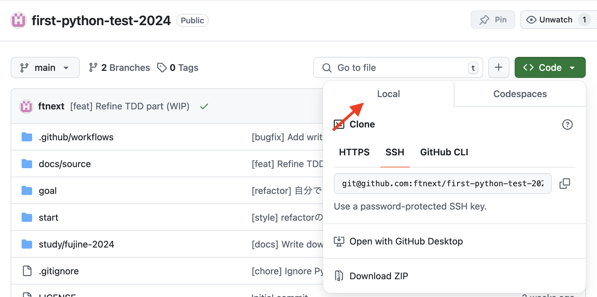
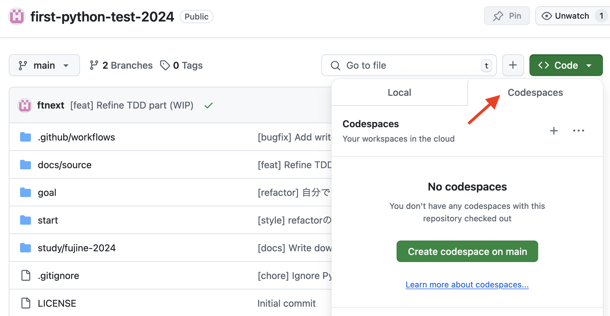

準備
====================

https://github.com/ftnext/first-python-test-2024 を開きます

| どちらかを選んでください。
| おすすめは選択肢1️⃣です。

選択肢1️⃣ ローカル開発環境
------------------------------

お手元のPCにPython環境が必要です。

本リポジトリをclone（またはZIPダウンロード）

:file:`start` ディレクトリで進めます

Python 3.10以上（`Structural Pattern Matching <https://docs.python.org/ja/3.13/whatsnew/3.10.html#pep-634-structural-pattern-matching>`__ を使いたいため）

.. code-block:: shell

    $ python -m venv .venv --upgrade-deps
    $ source .venv/bin/activate
    $ python -m pip install -e '.[dev]'

pytestとプロジェクトをインストールする

.. note:: editable install

    | 最初はスクリプトで全然よいのですが、高機能なものを作ろうとするとコード量が増え、1スクリプトだと限界が訪れます。
    | 複数ファイルを *プロジェクト* として扱う。
    | プロジェクトを再配布できるようにしています（:file:`pyproject.toml`）

    | 開発中のプロジェクトのインストールは editable install （:command:`pip install -e`）
    | ソースコードを :file:`site-packages` 下にコピーしません。
    | editable installしておけば、開発中にコードを変更しても再インストール不要です。

    `Development Mode (a.k.a. “Editable Installs”) <https://setuptools.pypa.io/en/stable/userguide/development_mode.html>`__

選択肢2️⃣ GitHub Codespaces
------------------------------

ブラウザとGitHubアカウントだけ必要

Codespacesは使い捨ての環境なので、仮想環境は不要です。

:file:`start` ディレクトリに移動して

.. code-block:: shell

    $ python -m pip install -e '.[dev]'

.. note:: Structural Pattern Matchingの日本語記事

    * `Python 3.10の新機能：構造化パターンマッチング <https://gihyo.jp/article/2022/07/monthly-python-2207>`__
    * `Pythonの構造的パターンマッチングのさらに便利なパターン紹介 <https://gihyo.jp/article/2024/01/monthly-python-2401>`__

.. note:: 標準に寄せたので uv お好きにどうぞ

    :file:`start` ディレクトリにて

    .. code-block:: shell

        $ uv pip install -e '.[dev]'
        $ uv run pytest
